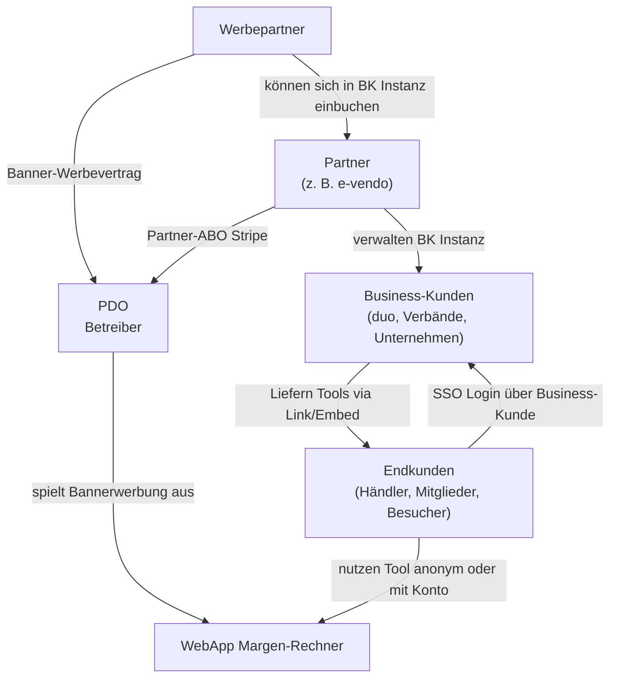

# PRD_stakeholder.md

# Stakeholder-, Rollen- und Geschäftsmodell-Dokument für produktdaten.org Tools

Dieses Dokument definiert das Rollenmodell, das Multi-Tenant-Betriebsmodell, die White-Label-Mechanik sowie die Monetarisierungsstruktur für alle aktuellen und zukünftigen produktdaten.org Tools (beginnend mit dem Margen-Rechner).
Es bildet die Grundlage für alle Funktions- und Versionspläne (z. B. v1–v8 des Margen-Rechners) und wird NICHT als Feature- oder Versionsbestandteil betrachtet.

---

# 1. Zielsetzung des Dokuments

Dieses Dokument beschreibt:

* das Stakeholder-Ökosystem
* die Rollen und Berechtigungen
* das Lizenz- und Geschäftsmodell
* die Architektur für Partner, Business-Kunden und Endkunden
* die White-Label-Branding-Mechanik
* die Monetarisierung über Stripe
* die Systemlogik rund um Instanzen, Banner und SSO

Ziel: **Klare Grundlage für alle White-Label-Anwendungen** im produktdaten.org Ökosystem.

---

# 2. Stakeholder

## 2.1 Betreiber (produktdaten.org, kurz „pdo“)

* Eigentümer der Plattform, APIs und aller Tools
* Verantwortlich für Hosting, Betrieb, Updates und Abrechnung
* Default-Partner, wenn kein anderer Partner eingetragen ist
* Darf eigene Werbepartner und Business-Kunden verwalten
* Rolle: "Super Admin" im System

---

## 2.2 Partner (z. B. e-vendo)

* Offizielle Vertriebspartner von produktdaten.org
* Können Tools an eigene Business-Kunden weitergeben
* Jede Partner-Instanz hat Branding im Footer:
  "präsentiert von PARTNERNAME" + Partner-Logo + Partner-Link
* Partner können:

  * ihre eigenen Business-Kunden verwalten
  * Werbebanner für ihre Kunden freischalten
  * White-Label-Themes pflegen
* Partner ist gleichzeitig **auch selbst Business-Kunde** (eigene Instanz)
* Stripe-Abrechnung: spezielles Partnerabo

---

## 2.3 Business-Kunden (Verbände, Unternehmen, Franchisegruppen)

Beispiele: duo, vedes, Händlergruppen, große Händler, Verbände.

* Jede Business-Kunden-Instanz ist ein **White-Label-Mandant**
* 1 Business-Kunde = 1 kostenpflichtige Instanz
* Kann White-Label-Tools auf der eigenen Website einbetten oder verlinken
* Business-Kunde wird einem Partner zugeordnet (oder pdo direkt)
* Optionales Feature: **SSO für Mitglieder**
* Optional: Werbebanner der Partner/Werbepartner anzeigen
* Optional: Konfiguration für Händler-Defaults (Rabatte, MwSt, Konditionen)

---

## 2.4 Endkunden (Nutzer des Tools)

* Händler, Mitglieder einer Organisation oder allgemeine Website-Besucher

* Endkunden können:

  * Tool anonym nutzen
  * sich per produktdaten.org Login anmelden
  * oder per SSO (wenn Business-Kunde dies gebucht hat)

* Endkundentypen:

  1. **Öffentliche Nutzer** (nutzen Tool anonym)
  2. **Mitglieder eines Verbands/Business-Kunden** (SSO)
  3. **Händler** (pdo Login)

---

## 2.5 Werbepartner

* Dürfen Banner im Tool schalten
* Freischaltung erfolgt über Partner
* Einnahmen gehen direkt an pdo (Abrechnung über Partner/BK separat)
* Mehrere Bannerzonen möglich (Kopfzeile, Footer)

---

# 3. Multi-Tenant Architektur (White-Label)

Jede Business-Kunden-Instanz ist ein eigener Mandant.

## Designprinzip:

**1 Partner verwaltet N Business-Kunden**
**1 Business-Kunde bedient N Endkunden**

### Identifikation einer Instanz erfolgt durch:

* Subdomain: `https://<kunde>.produkdaten.org/<tool>`
* oder Query Parameter: `?theme=<kunde>`

### Eine Instanz definiert:

* Corporate Farben
* Logo
* Impressum
* Footer-Branding
* Banner-Konfiguration
* SSO-Konfiguration
* Händler-Defaults

---

# 4. White-Label Branding

Jedes Tool lädt beim Start **mandantenspezifische Theme-Daten**:

### Theme-Daten enthalten:

* Logo
* Primärfarbe / Sekundärfarbe
* Textfarbe
* Impressumsangaben
* Footer-Branding
* Partner-Branding („präsentiert von …“)
* Banner-Konfiguration
* Varianten für Light/Dark Mode

**Quelle:**

```
GET /api/theme/{key}
```

oder statische JSON-Dateien pro Mandant.

---

# 5. Rollen & Berechtigungen

| Rolle               | Darf Business-Kunden verwalten | Darf Partner verwalten | Darf Banner schalten        | SSO verwalten   | Branding Pflegen |
| ------------------- | ------------------------------ | ---------------------- | --------------------------- | --------------- | ---------------- |
| **pdo (Betreiber)** | ✓                              | ✓                      | ✓                           | ✓               | ✓                |
| **Partner**         | ✓                              | ✗                      | ✓ (für BK)                  | ✓ (für BK)      | ✓ (für BK)       |
| **Business-Kunde**  | ✗                              | ✗                      | ✓ (nur eigene Werbepartner) | ✓ (für Instanz) | ✓ (für Instanz)  |
| **Werbepartner**    | ✗                              | ✗                      | nur freigeschaltete Banner  | ✗               | ✗                |
| **Endkunden**       | ✗                              | ✗                      | sehen Banner                | ✗               | ✗                |

---

# 6. Monetarisierungsmodell (Stripe)

Alle Einnahmen werden über produktdaten.org als Stripe-Abo abgewickelt.

### 6.1 Stripe-Produkte / Tarife

#### **1. Business-Kunden-Instanz (monatlich)**

* Basispreis pro Instanz
* Enthält: White-Label-Branding, Bereitstellung der Tools

#### **2. Partner-Abo (monatlich)**

* Partner darf Business-Kunden verwalten
* Partner wird im Footer präsentiert
* Partner kann Banner freischalten
* Partner erhält Dashboard für seine Kunden

#### **3. SSO Add-on (pro Business-Kunde)**

* Mitglieder-Login ohne zusätzliches pdo-Konto
* Optional pro Business-Kunde aktivierbar

#### **4. Werbebanner-Paket**

* Aktivierbare Banner pro Business-Kunde
* Preis abhängig von Reichweite oder Paket

#### **5. Premium API Nutzung**

* Optional (wenn Tools API-Minuten benötigen)

#### **6. Optional: Cloud-Speicherung von Kalkulationen**

* Erhöhtes Kontingent oder zusätzlicher Speicher

---

# 7. Werbebanner-System

### Funktionsweise:

* Abhängig vom Mandanten (Business-Kunde), nicht global
* Partner kann festlegen, ob Banner erlaubt sind
* Werbepartner bekommen API-Zugang für ihren Banner

### API Beispiel:

```
GET /api/margenrechner/banner/{business_kunde_key}
```

Antwort enthält:

* Bild-URL
* Link-URL
* Tracking-ID
* Aktiv von/bis
* Sichtbarkeit

### Banner-Slots:

* Kopfzeile
* Unterhalb der Navigationsleiste
* Footer

---

# 8. Single Sign-On (SSO)

### SSO ist optional und kostenpflichtig.

### Ablauf:

1. Business-Kunde schaltet SSO im Stripe-Abo frei
2. Business-Kunde hinterlegt SSO-Einstellungen:

   * Identity Provider URL
   * Sign-Zertifikat
   * Redirect URLs
3. Nutzer kommt von der BK-Website → wird via SSO authentifiziert
4. Tool erhält Token und lädt personalisierte Daten

---

# 9. Instanzmodell

Eine Instanz = eine Business-Kunden-Lizenz.

### Eigenschaften einer Instanz:

* `instance_key`
* Branding (Logo/Farben)
* Impressumsangaben
* Theme-Konfiguration
* Partner-Zuweisung
* SSO-Einstellungen (optional)
* Banner-Konfiguration
* Händler-Defaults
* API-Limits

### Datenspeicherung pro Instanz:

* Konfiguration
* Berechtigungen
* Links zum Partner

**Nicht** instanzspezifisch sind:

* globale Produktdatenbank
* globale Artikelsuche

---

# 10. Partner- / Instanz-Beziehungen

```
pdo (Betreiber)
  ├── Partner A (e-vendo)
  │       ├── Business-Kunde 1 (duo)
  │       ├── Business-Kunde 2
  │       └── Business-Kunde 3
  ├── Partner B
  └── Partner C
```

Ein Partner ist gleichzeitig ein Business-Kunde, besitzt also:

* eigene Partner-Instanz
* eigene Business-Kunden
* eigenes Branding

---

# 11. Zusammenfassung

Dieses Stakeholder- und Rollenmodell bildet das Fundament für:

* alle White-Label produktdaten.org Tools
* alle Lizensierungs- und Abrechnungsmodelle über Stripe
* die technische Multi-Tenant-Architektur
* zukünftige Erweiterungen (SSO, Banner, Partner-Level, Händler-Defaults)

Alle Versionspläne (z. B. Margen-Rechner v1–v8) bauen funktional auf diesem Dokument auf.

---

# 12. Architekturdiagramm (Mermaid)


